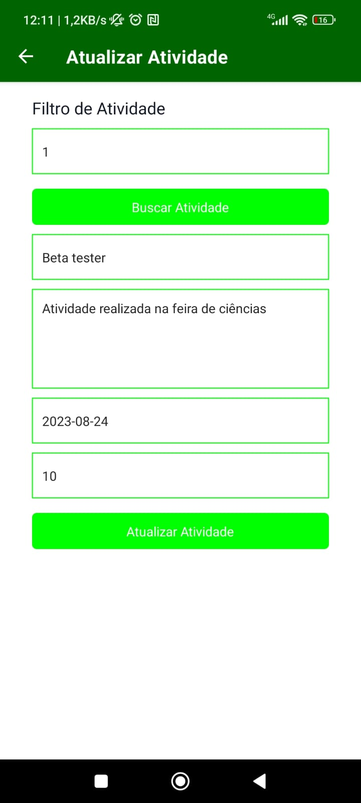

# Gerenciamento de Atividades Extracurriculares

## 🖼️ Imagens do Projeto

</br>

<div align="center">
  
  
  
  
  
  
  
</div>

</br>

## 📋 Funcionalidades

As seguintes funcionalidades estão presentes no projeto:

* Adicionar Atividade;
* Remover Atividade;
* Alterar Atividade;
* Listar Atividade;
* Buscar Atividade por ID;
* Listagem de Todas Atividades;
* Listagem por data.


## 🛠️ Construído com

* [NodeJS](https://nodejs.org/en/) - Ambiente de execução do Javascript
* [React Native](https://reactnative.dev/) - Framework Mobile
* [Expo](https://expo.io/) - Facilitador de visualização
* [SQLite](https://www.sqlite.org/index.html) - Banco de Dados
* [VsCode](https://code.visualstudio.com/) - IDE de Desenvolvimento

* Dependências
  * @expo/webpack-config": "^0.17.2",
  * @react-native-community/datetimepicker": "^6.5.2",
  * @react-navigation/native": "^6.1.6",
  * @react-navigation/native-stack": "^6.9.12",
  * date-fns": "^2.30.0",
  * expo": "^47.0.0",
  * expo-sqlite": "~11.0.0",
  * expo-status-bar": "~1.4.2",
  * react": "^18.1.0",
  * react-dom": "^18.1.0",
  * react-native": "^0.70.8",
  * react-native-gesture-handler": "~2.8.0",
  * react-native-reanimated": "~2.12.0",
  * react-native-safe-area-context": "4.4.1",
  * react-native-screens": "~3.18.0",
  * react-native-vector-icons": "^8.0.0",
  * react-native-web": "~0.18.7"

</br>

## 🚀 Como executar o projeto

### Pré-requisitos

Antes de começar, você vai precisar ter instalado em sua máquina as seguintes ferramentas: Git, Expo e Node.js (de preferência nas versões mais recentes). Além disso, é bom ter um editor para trabalhar com o código como VSCode. Também é necessário Expo GO Instalado no Celular.

```bash
# Clone este repositório
$ git clone https://github.com/Gustavo-Cruz-Pinheiro/gerenciamento-atividades.git

# Acesse a pasta do Projeto
$ cd gerenciamento-atividades

# Baixar as dependências
$ npm install
ou
$ yarn install

# execute o comando
$ npm start
ou
$ yarn start

```

## Autor

Gustavo Cruz Pinheiro

### Me siga nas redes sociais

<a href="https:/https://github.com/Gustavo-Cruz-Pinheiro"></a>
<a href="https://www.instagram.com/gusttavo.cruz"></a>
<a href="https://www.facebook.com/gustavocruzpinheiro"></a>
<a href="https://www.linkedin.com/in/gustavo-cruz-pinheiro-61b852217/"></a>
